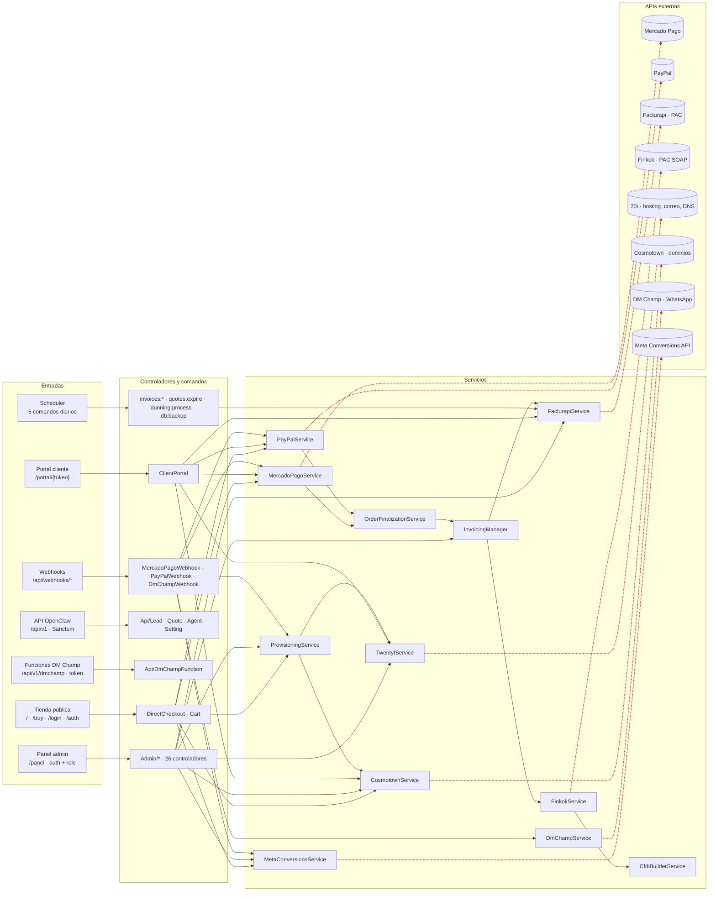
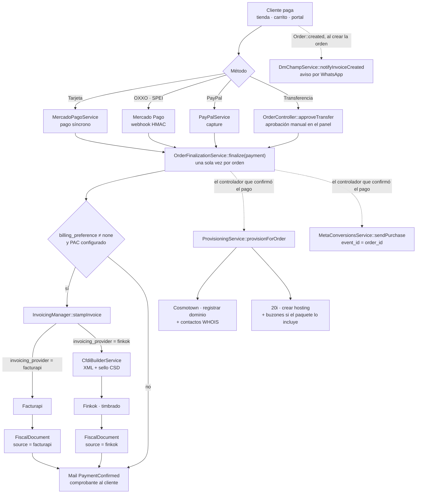
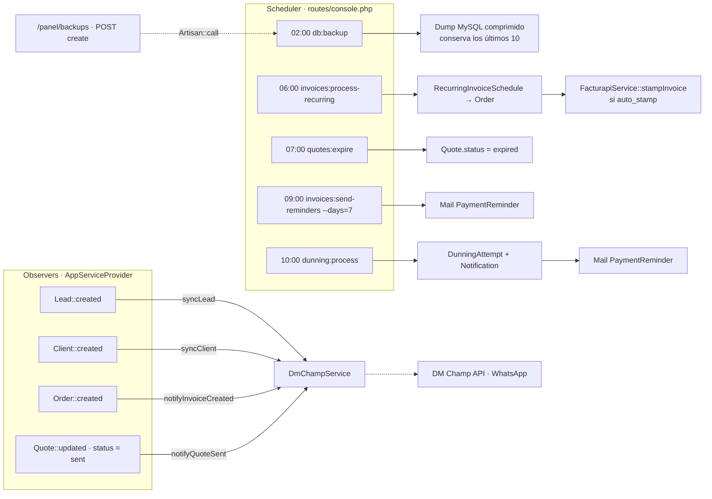

# Grafo de arquitectura — CRM Mosley

Mapa de dependencias del repositorio generado a partir del código (rutas, controladores, servicios, modelos, comandos, eventos y APIs externas). Sirve para orientarse en el proyecto, evaluar el impacto de un cambio y detectar acoplamientos.

| Artefacto | Qué contiene |
|---|---|
| `docs/graph/crm-graph.json` | Grafo completo: 129 nodos y 365 aristas tipadas. Fuente de verdad para herramientas. |
| `docs/graph/crm-overview.svg` / `.dot` | Vista de arquitectura: entradas → controladores → servicios → APIs externas (sin modelos). |
| `docs/graph/crm-models.svg` / `.dot` | Modelos Eloquent y sus relaciones. |
| `docs/graph/crm-graph.svg` / `.dot` | Todo junto (denso; útil para buscar un nodo concreto). |
| `scripts/build-graph.php` | Generador. Análisis estático puro, no necesita `vendor/`. |

Regenerar tras cambios en el código:

```bash
php scripts/build-graph.php                       # JSON + DOT en docs/graph/
dot -Tsvg docs/graph/crm-overview.svg ...         # con Graphviz instalado, o:
npx -p @viz-js/viz -c "viz" < docs/graph/crm-overview.dot > docs/graph/crm-overview.svg
```

Los diagramas de abajo son una lectura curada del mismo grafo (Mermaid, se renderizan en GitHub).

---

## 1. Resumen en números

| Capa | Cantidad | Detalle |
|---|---|---|
| Zonas de entrada HTTP | 17 | 12 web + 5 API, agrupadas por prefijo y middleware |
| Controladores | 38 | 26 `Admin/*`, 5 `Api/*`, 2 `Auth/*`, 5 públicos (tienda, portal, webhooks) |
| Servicios | 12 | 8 hablan con APIs externas, 4 son orquestadores internos |
| Modelos Eloquent | 33 | 64 relaciones; 41 tablas en migraciones |
| Comandos Artisan | 6 | 5 programados en el scheduler + `mail:test` |
| Mailables | 6 | Cada uno con su vista en `resources/views/emails/` |
| Eventos de modelo | 4 | Observers en `AppServiceProvider` que sincronizan con DM Champ |
| APIs externas | 8 | Mercado Pago, PayPal, Facturapi, Finkok, 20i, Cosmotown, DM Champ, Meta CAPI |
| Vistas Blade | 88 | admin (54), portal (11), tienda (7), emails (6), pdf (3), resto |
| Tests | 11 archivos | 44 casos, todos `Feature` |

Stack: Laravel 12 · PHP 8.2+ · MySQL 8 · Blade + Alpine.js + Tailwind 4 · Sanctum · DomPDF · Docker/Nginx/Traefik.

---

## 2. Arquitectura por capas

Cómo entra una petición y hasta dónde llega. Las flechas rojas salen del sistema.



Lecturas rápidas:

- **Los controladores públicos y de portal llegan directo a los servicios de pago.** `DirectCheckoutController`, `CartController` y `ClientPortalController` instancian `MercadoPagoService` y `PayPalService`; los webhooks cierran el ciclo.
- **`OrderFinalizationService` es el embudo post-pago.** Lo invocan `MercadoPagoService` y `PayPalService` una sola vez cuando la orden pasa a pagada: timbra el CFDI vía `InvoicingManager` y envía `PaymentConfirmed`.
- **`InvoicingManager` decide el PAC** según `Setting('invoicing_provider')`: Facturapi (timbra el PAC) o Finkok (el CRM construye y sella el XML con `CfdiBuilderService`, Finkok solo timbra).
- **`ProvisioningService` es idempotente**: registra el dominio en Cosmotown y crea el hosting en 20i tras un pago confirmado.
- `Api/*` (OpenClaw) y `Api/DmChampFunction` no tocan servicios externos: solo leen y escriben modelos.

---

## 3. Flujo de negocio: del pago a la factura y el aprovisionamiento

Es el camino más largo del sistema y el que cruza más capas.



Notas del flujo:

- `ProvisioningService` y `MetaConversionsService` **no** los llama `OrderFinalizationService`, sino cada controlador que confirma el pago (`CartController`, `DirectCheckoutController`, los dos webhooks y `OrderController`). Son cinco puntos de llamada que deben mantenerse sincronizados.
- La cancelación de CFDI se enruta por el proveedor que **timbró** (`FiscalDocument.source`), no por el ajuste actual, así que cambiar de PAC no rompe cancelaciones antiguas.

---

## 4. Modelo de datos

Relaciones declaradas en los modelos Eloquent. `ActivityLog` y `Setting` son transversales y se omiten del grafo para no ensuciarlo.

```mermaid
erDiagram
  USER ||--o{ LEAD : "assigned_to"
  USER ||--o{ PERMISSION : tiene
  USER ||--o{ NOTIFICATION : recibe
  USER ||--o{ AGENT_CONTROL : registra
  USER ||--o{ ACTIVITY_LOG : genera
  ACTIVITY_LOG }o--|| SUBJECT : "subject (polimórfico)"

  LEAD ||--o{ LEAD_NOTE : tiene
  LEAD ||--o{ LEAD_STATUS_HISTORY : historial
  LEAD ||--o{ QUOTE : recibe
  LEAD ||--o{ TASK : tiene
  LEAD ||--o| CLIENT : "se convierte en"

  QUOTE ||--o{ QUOTE_ITEM : contiene
  QUOTE_ITEM }o--|| SERVICE : referencia
  QUOTE ||--o{ ORDER : genera
  QUOTE ||--o{ RECURRING_INVOICE_SCHEDULE : origina

  CLIENT ||--o{ ORDER : "invoices()"
  CLIENT ||--o{ CLIENT_SERVICE : contrata
  CLIENT_SERVICE }o--|| SERVICE : referencia
  CLIENT ||--o{ CLIENT_DOCUMENT : guarda
  CLIENT }o--o{ TAG : "client_tag"
  CLIENT ||--o{ SUPPORT_TICKET : abre
  CLIENT ||--o{ TASK : tiene
  CLIENT ||--o{ RECURRING_INVOICE_SCHEDULE : tiene
  CLIENT ||--o{ TICKET_REPLY : escribe

  SUPPORT_TICKET ||--o{ TICKET_REPLY : tiene
  SUPPORT_TICKET }o--o| USER : "assigned_to"
  TICKET_REPLY }o--o| USER : escribe
  TASK }o--o| USER : "assigned_to · created_by"

  RECURRING_INVOICE_SCHEDULE ||--o{ RECURRING_INVOICE_ITEM : contiene

  ORDER ||--o{ INVOICE_ITEM : contiene
  ORDER ||--o{ PAYMENT : recibe
  ORDER ||--o| FISCAL_DOCUMENT : "CFDI timbrado"
  ORDER ||--o{ DUNNING_ATTEMPT : reintentos

  SERVICE_CATEGORY ||--o{ SERVICE : agrupa
  SERVICE_BUNDLE ||--o{ SERVICE_BUNDLE_ITEM : contiene
  SERVICE_BUNDLE_ITEM }o--|| SERVICE : referencia
  CART_ITEM }o--|| SERVICE : referencia
```



Modelos sin relaciones Eloquent: `DiscountCode`, `Setting` (clave/valor con caché), `ClientInvoice` (legacy: las facturas se migraron a `orders`; ningún código lo usa).

Núcleo del dominio por grado de conexión: **Client** (11 relaciones), **User** (9), **Order** (8), **Lead** (6), **Service** (6). Un cambio en `Client` u `Order` afecta a casi todos los controladores.

---

## 5. Automatizaciones: scheduler y eventos de modelo



`DmChampService` está registrado como singleton y se resuelve perezosamente en cada observer; si `dmchamp_enabled` está apagado las llamadas son no-op.

---

## 6. Zonas de acceso

Cada zona es un prefijo con su middleware de grupo. El middleware inline por ruta (`throttle:payments`, `throttle:login`, …) está en `crm-graph.json` en la meta de cada arista `routes_to`.

| Zona | Middleware | Controladores |
|---|---|---|
| `/`, `/buy` | ninguno (público) | DirectCheckout, Cart |
| `/login`, `/logout`, `/auth` | ninguno · `throttle:login`, `throttle:5,1` | Auth/Login, Auth/MagicLink |
| `/panel` | `auth` | Dashboard, Lead, Quote, Client, ClientService, Document, Domain, Mailbox, Dns, Ticket, Task |
| `/panel` | `auth` + `role:admin` | ServiceCategory, Service, ServiceBundle, Setting, AgentControl, ActivityLog, DiscountCode, Tag, Permission, User (`role:admin` inline) |
| `/panel` | `auth` + `role:admin,accounting` | Order, RecurringInvoice |
| `/panel/reports` | `auth` + `role:admin,accounting` | Report |
| `/panel/backups` | `auth` + `role:admin` | closures → `db:backup` |
| `/panel/notifications` | `auth` | Notification |
| `/portal/{token}` | `portal` (ValidatePortalToken) | ClientPortal (37 rutas) |
| `/api/v1` | `throttle:60,1` (público) | closures: `test`, `services` |
| `/api/v1` | `auth:sanctum` | Api/Lead, Api/Quote, Api/Agent, Api/Setting |
| `/api/v1/dmchamp` | `throttle:60,1` + `no.cache` + DmChampTokenMiddleware | Api/DmChampFunction |
| `/api/webhooks` | `throttle:webhooks` (firma HMAC / verificación PayPal en el controlador) | MercadoPagoWebhook, PayPalWebhook, DmChampWebhook |

---

## 7. Hallazgos derivados del grafo

1. **`ClientInvoice` es código muerto.** Ningún controlador, servicio, comando ni test lo referencia; `Client::invoices()` ya devuelve `Order`. La tabla `client_invoices` sigue existiendo en migraciones.
2. **`invoices:process-recurring` salta `InvoicingManager`.** Timbra con `FacturapiService` directamente y solo si existe `facturapi_api_key`, por lo que con `invoicing_provider = finkok` las facturas recurrentes con `auto_stamp` no se timbran (o se timbran con el PAC equivocado). Es el único flujo de timbrado que no pasa por el manager.
3. **`ClientPortalController` es el nodo más cargado del grafo:** 37 rutas, 11 modelos, 5 servicios (pagos, facturación, correo, dominios, DNS) en un solo archivo. Dividirlo por dominio (pagos, soporte, dominio/DNS) reduciría el radio de impacto de cada cambio.
4. **Post-pago repartido en cinco sitios.** `ProvisioningService` y `MetaConversionsService` se invocan desde `CartController`, `DirectCheckoutController`, `MercadoPagoWebhookController`, `PayPalWebhookController` y `OrderController`, mientras que timbrado y correo ya están centralizados en `OrderFinalizationService`. Mover esas dos llamadas al mismo servicio cerraría el embudo.
5. **Servicios instanciados con `new` en lugar del contenedor.** Salvo `DmChampService` (singleton), todos los servicios se crean con `new XService()` dentro de controladores y otros servicios, y leen su configuración de `Setting::get()` en el constructor. Funciona, pero dificulta sustituirlos en tests (los tests existentes usan `Http::fake()` para sortearlo).
6. **Acceso a `/api/v1/services` es público** (solo `throttle`), expone catálogo y precios sin token. Coincide con la documentación de OpenClaw; se anota por si no era intencional.
7. **Cosmotown apunta a sandbox por defecto** (`cosmotown_base_url` en `Setting`); conviene verificar el valor en producción.

---

## 8. Cómo leer `crm-graph.json`

```jsonc
{
  "nodes": [{ "id": "service:InvoicingManager", "label": "InvoicingManager", "type": "service", "meta": { "file": "...", "description": "..." } }],
  "edges": [{ "from": "routes:web:/panel|auth,role:admin,accounting", "to": "controller:Admin/OrderController", "type": "routes_to",
              "meta": { "routes": ["PATCH /panel/orders/{order}/stamp → stamp()"], "middleware": [] } }]
}
```

Tipos de nodo: `routes`, `scheduler`, `middleware`, `controller`, `command`, `service`, `mail`, `model`, `event`, `external`.

Tipos de arista: `routes_to`, `guarded_by`, `uses_service`, `uses_model`, `sends_mail`, `calls_api`, `relation` (con `kind` y `method`), `schedules` (con `when`), `invokes`, `fires`.

Ejemplo, listar todo lo que toca `Order`:

```bash
php -r '$g=json_decode(file_get_contents("docs/graph/crm-graph.json"),true);
  foreach($g["edges"] as $e) if($e["to"]==="model:Order") echo $e["from"],"\n";'
```
